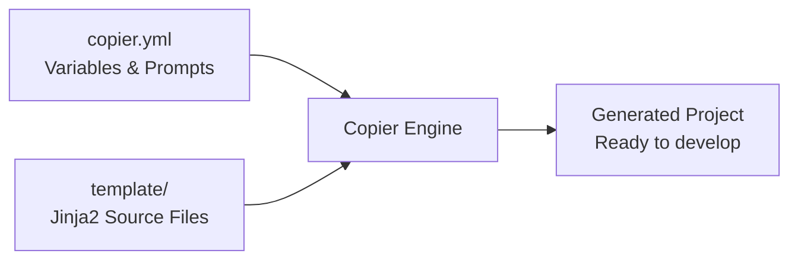

# About the Architecture

This page explains how python-package-copier is designed and how the template maps to generated projects.

## How Template Generation Works

Python-package-copier is a [Copier](https://copier.readthedocs.io/) template - a collection of Jinja2 files that Copier renders into a complete Python project based on user answers.

The `copier.yml` file defines the questions asked during generation (project name, Python version, etc.). The `template/` directory contains the source files - some are static (copied as-is) and some are `.jinja` files (rendered with variable substitution).

### Conditional Content

The template uses Copier's conditional directory and file naming to include or exclude content:

- **Conditional directories**: `template/examples/` - the entire directory is skipped when `include_examples=false`
- **Conditional files**: `template/docs/pages/examples.md.jinja` - individual files can be conditional
- **Inline conditionals**: Jinja `` blocks within `.jinja` files control which sections appear

## src Layout

Generated projects use the `src/` layout (`src/<package_name>/`):

- Prevents accidental imports from the source directory during testing - forces installation, catching packaging errors early
- Matches [PyPA recommendations](https://packaging.python.org/en/latest/discussions/src-layout-vs-flat-layout/) for distributable packages
- Clean separation between source code, tests, and docs

## hatchling + hatch-vcs

The build system uses **hatchling** as the build backend and **hatch-vcs** for version management:

- Lightweight and fast, with native `src/` layout support
- Version is derived automatically from Git tags - tagging `v1.2.3` sets the package version to `1.2.3`
- Zero version management overhead

## nox + just (Two-Layer Commands)

The template provides two command interfaces:

| Layer | Tool | Purpose | When to Use |
|-------|------|---------|-------------|
| Outer | just | Convenience aliases for daily development | `just test`, `just fix`, `just serve` |
| Inner | nox | Multi-version testing and CI automation | `uvx nox -s test` (tests across Python 3.11–3.14) |

The three layers compose: `just` calls `nox`, which uses `uv` internally for package installation. Just provides short aliases for the 90% case, while nox handles multi-version matrices and environment isolation.

## Pre-commit Hooks

The template configures pre-commit hooks that run locally before each commit:

- Fast feedback - catches formatting and linting issues in seconds, not after a CI round-trip
- Every commit is clean, not just every PR
- Optional - CI still runs the same checks via `nox -s fix` as a safety net

## The Testing Architecture

### Two Levels of Testing

The template tests operate at two levels:

1. **Template tests** (this repo's `tests/`): Verify that Copier generates correct files with correct content. These are fast and don't run any code in the generated project.

2. **Generated project tests** (via `just gen test`): Actually run nox sessions in a freshly generated project. These are slow but verify end-to-end correctness.

### Test Markers

The `@pytest.mark.slow` and `@pytest.mark.integration` markers enable a two-tier CI strategy:

- **Draft PRs**: Only fast tests run (2–3 minutes), giving quick feedback during development
- **Ready PRs**: Full test suite runs (fast + slow + integration across all OS and Python versions)

This optimizes for both developer experience (fast iteration) and release quality (thorough validation).

## Connections

- [Release Process](release-process.md) - how the multi-step release pipeline works
- [Project Structure](../reference/project-structure.md) - what files the template generates
- [Commands](../reference/commands.md) - the just/nox/uv command hierarchy
