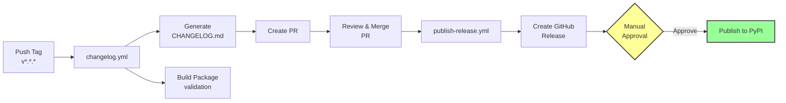

# About the Release Process

This page explains how the automated release pipeline works.

## Overview

The release pipeline converts a Git tag into a published PyPI package through a series of automated steps with a human checkpoint:

## Two Separate Workflows

The release is split into two workflows:

1. **changelog.yml** - Triggered by tag push, generates changelog, builds packages, creates a PR
2. **publish-release.yml** - Triggered by PR merge, creates GitHub Release, publishes to PyPI

Each workflow has a single responsibility - preparation vs. publication. The PR between them creates a natural review point where maintainers can verify the changelog and build before anything is published.

## Manual Approval Before PyPI

Publishing to PyPI is irreversible. The manual approval gate (via GitHub [environment protection rules](https://docs.github.com/en/actions/deployment/targeting-different-environments/using-environments-for-deployment)) provides human verification, an emergency brake for bad releases, and a clear audit trail.

## Trusted Publishing (OIDC)

The template uses PyPI's [Trusted Publishing](https://docs.pypi.org/trusted-publishers/):

- No stored secrets - authentication uses short-lived OIDC tokens generated by GitHub Actions
- Workflow-scoped - only `publish-release.yml` in the specific repository can publish
- Environment-scoped - the OIDC token is only available after manual approval

## Changelog Generation

The changelog is generated automatically from [Conventional Commits](https://www.conventionalcommits.org/) using git-cliff - `feat:` commits appear under **Added**, `fix:` under **Fixed**, breaking changes are highlighted prominently. The template enforces conventional commits via pre-commit hooks and PR title validation.

## Version Numbering

The template follows [Semantic Versioning](https://semver.org/):

- **MAJOR** (1.0.0): Breaking changes (indicated by `!` or `BREAKING CHANGE:`)
- **MINOR** (0.1.0): New features (`feat:` commits)
- **PATCH** (0.0.1): Bug fixes (`fix:` commits)

The version is determined by the Git tag - there is no version file to manually edit. The `hatch-vcs` build plugin reads the tag and sets the package version accordingly.

## The Complete Flow in Practice

1. Developer pushes a version tag: `git tag v0.2.0 -m "Release v0.2.0" && git push origin v0.2.0`
2. `changelog.yml` generates the changelog, builds the package, creates a PR
3. Maintainer reviews and merges the PR
4. `publish-release.yml` creates a GitHub Release with artifacts
5. Designated reviewer receives a notification and approves the PyPI deployment
6. Package is published to PyPI via Trusted Publishing

## Connections

- [How to Set Up CI/CD Services](../how-to/setup-cicd.md) - step-by-step setup instructions
- [GitHub Workflows](../reference/github-workflows.md) - workflow technical reference
