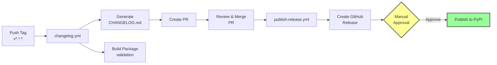

# GitHub Workflows

All workflows are conditional on `include_actions=true` (the default).

## Release Workflow

The automated release process follows this flow with a **manual approval gate** before PyPI publishing:

**Complete release flow**: Tag push → Changelog + Build → PR creation → Review & Merge → GitHub Release → **Manual Approval** → PyPI publish

See [About the Release Process](../explanation/release-process.md) for the design rationale behind this multi-step approach.

## Workflow Reference

### tests.yml - Continuous Integration

**Triggers**: Push to main, pull requests

- Tests across multiple Python versions (configurable via `min_python_version` and `max_python_version`, defaults to 3.11–3.14)
- Tests on Ubuntu, Windows, and macOS
- Matrix of 15 combinations
- Uploads coverage to Codecov (requires `CODECOV_TOKEN` secret)
- Uploads test results to Codecov

### pr-title.yml - Pull Request Title Validation

**Triggers**: Pull requests to main

- Validates PR title follows [Conventional Commits](https://www.conventionalcommits.org/) format
- Required types: `feat`, `fix`, `docs`, `style`, `refactor`, `perf`, `test`, `build`, `ci`, `chore`, `revert`
- Ensures consistency with changelog generation (git-cliff)

### changelog.yml - Automated Changelog and Build

**Triggers**: Version tags (`v*.*.*`)

- Generates changelog from conventional commits using git-cliff
- Creates a Pull Request with updated `CHANGELOG.md`
- Runs pre-commit hooks on generated changelog
- Builds and validates package distributions
- Stores distributions as workflow artifacts for reuse (avoiding rebuilds)

**Required secret**: `CHANGELOG_AUTOMATION_TOKEN`

### publish-release.yml - GitHub Releases and PyPI Publishing

**Triggers**: Changelog PR merged to main

- Detects merged PRs with the `changelog` label
- Extracts version from PR title
- Downloads build artifacts from changelog workflow
- Creates a GitHub Release with release notes and distribution attachments
- Publishes to PyPI with manual approval (Trusted Publishing via OIDC)

**Required environment**: `pypi` with required reviewers configured

### nightly.yml - Proactive Monitoring

**Triggers**: Daily schedule

- Tests against latest dependencies
- Uploads coverage to Codecov (requires `CODECOV_TOKEN` secret)
- Creates GitHub issue on failure

## Required Secrets and Environments

| Secret/Environment | Used By | Purpose |
|--------------------|---------|---------|
| `CHANGELOG_AUTOMATION_TOKEN` | changelog.yml | Fine-grained PAT with Contents (R+W) + Pull Requests (R+W) |
| `CODECOV_TOKEN` | tests.yml, nightly.yml | Coverage upload token |
| `pypi` environment | publish-release.yml | Environment with required reviewers for manual approval |

!!! note "Environment protection rules"
    The `pypi` environment requires **public repositories** or **GitHub Pro/Team/Enterprise** plans.

See [How to Set Up CI/CD Services](../how-to/setup-cicd.md) for step-by-step configuration instructions.

### Configuring Manual Approval for PyPI

To enable the manual approval gate before PyPI publishing:

1. Navigate to repository **Settings → Environments**
2. Create or select the `pypi` environment
3. Enable **Required reviewers** under *Deployment protection rules*
4. Add one or more reviewers who must approve before PyPI publication
5. (Optional) Enable **Wait timer** to delay deployment after approval

When a release is ready:

- The workflow pauses at the "Wait for approval" step
- Designated reviewers receive a notification
- Reviewers can inspect the GitHub Release and artifacts before approving
- Once approved, the package is automatically published to PyPI
